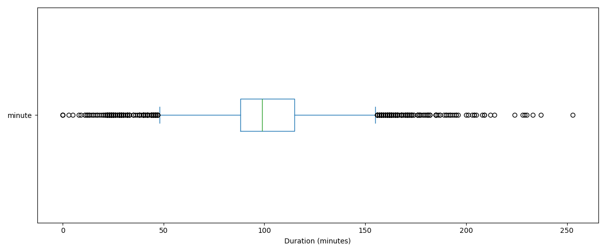

# Netflix Data Cleaning with Pandas

This project focuses on cleaning and exploring the Netflix titles dataset using **pandas**.  
The main goal was to identify missing values, handle inconsistent data, detect outliers in movie duration, and normalize text fields for cleaner analysis.

## Project Overview

This notebook includes:
- dataset overview
- missing data analysis
- handling null values
- outlier detection using histograms and boxplots
- categorical distribution analysis
- text normalization for movie titles

## Dataset

- **Rows:** 8807
- **Columns:** 12

Main columns used:
- `type`
- `title`
- `director`
- `cast`
- `country`
- `release_year`
- `rating`
- `duration`

## Key Cleaning Steps

- checked missing values by column
- filled missing values in `rating` using the mode
- investigated inconsistent values in `duration`
- created a numeric `minute` column from `duration`
- detected outliers with histogram and boxplot
- normalized movie titles by removing extra spaces and punctuation

## Project Preview

## Tools Used

- Python
- pandas
- matplotlib
- Jupyter Notebook

## Files

- `netflix_data_cleaning.ipynb`
- `netflix_titles.csv`
- `requirements.txt`

## Author

Created by **Angelo Miletić**
